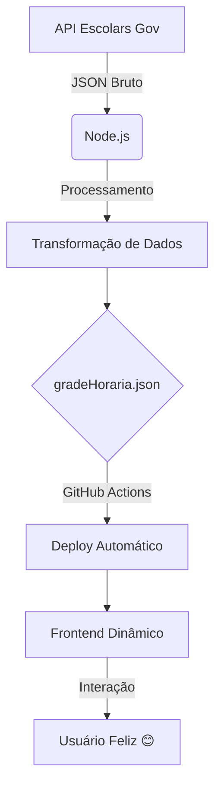
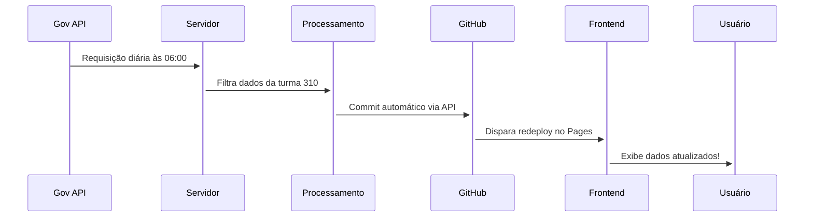

```markdown
# 🚀 Grade Horária 310 - Documentação Técnica


---

## 🌟 **Funcionalidades Mágicas**
- ✅ **Detecção Automática do Dia Atual**  
- 📊 **Barra de Progresso das Aulas** (com cálculos em tempo real)  
- 🔄 **Auto-Recarregamento** nos horários de troca de aula  
- 📲 **Design Responsivo** (funciona até em relógio inteligente!)  
- 🎮 **Transições Animadas** entre dias da semana  
- 📤 **Compartilhamento Direto** via WhatsApp com formatação especial  

---

## 🛠 **Arquitetura do Sistema**


---

## ⚡ **Tecnologias Nucleares**

| Categoria       | Stack                                                                                   | Ícones               |
|-----------------|-----------------------------------------------------------------------------------------|----------------------|
| **Core**        | JavaScript ES6+, HTML5 Semântico, CSS3 Moderno                                         | 📜🎨⚡              |
| **APIs**        | GitHub API, API Escolars (não-oficial), Font Awesome                                   | 🔗🛠️               |
| **Efeitos**     | CSS Variables, Flexbox, Grid, Blur Effects, Keyframe Animations                        | ✨🎭                |
| **Automação**   | GitHub Actions, Cron Jobs (para atualizações diárias)                                  | 🤖⏰                |
| **Segurança**   | Environment Secrets, CORS Manipulation, Content Security Policy                       | 🔒🛡️               |

---

## 🔥 **Fluxo de Dados em Tempo Real**


---

## 🚨 **Aviso Crítico** 
<div align="center" style="border: 2px solid #BD93F9; padding: 15px; border-radius: 10px; margin: 20px 0;">
  <h3 style="color: #EF5656;">⚠️ ALERTA DE INSTABILIDADE</h3>
  <p>Este projeto utiliza endpoints <strong>não documentados</strong> do governo!<br> 
  Qualquer mudança na API oficial pode <em>quebrar totalmente o sistema</em> sem aviso prévio!<br>
  🕵️♂️ Mantenha-se atualizado pelo <a href="https://t.me/grade310">Canal do Telegram</a></p>
</div>

---

## 🎮 **Interface do Usuário**


### Recursos Visuais:
- 🌓 **Dark Mode Automático**  
- 📌 **Efeito Neon** nos elementos interativos  
- 🌀 **Blur Dinâmico** no modal de detalhes  
- 📐 **Layout Responsivo** que se adapta até em 320px  
- 🔄 **Animações Suaves** nas transições de dia  

---

## 🔧 **Pré-requisitos da API**
```json
{
  "endpoint": "https://secweb.procergs.com.br/ise-escolars-estudante/rest/...",
  "headers": {
    "Authorization": "Bearer [TOKEN_SECRETO]",
    "Content-Type": "application/json"
  },
  "requirements": {
    "CPF_VÁLIDO": "05099946011",
    "TURMA_ATIVA": "310"
  }
}
```

---

## 📜 **Licenciamento**
<div align="center">
  
  <p>🔓 Use, modifique e distribua livremente - perfeito para estudos de integração com APIs governamentais!</p>
</div>

---

## 👨💻 **Créditos Épicos**
- **Desenvolvedor Principal**: [Kauã "O Mago do JSON" Ferreira](https://github.com/zKauaFerreira) 🧙♂️  
- **Apoio Técnico**: Comunidade [@he4rt](https://github.com/he4rt) ❤️  
- **Beta Testers**: Turma 310 🧪🔍  

---

🔗 **Acesso Imediato**: [https://zkauaferreira.github.io/310](https://zkauaferreira.github.io/310)  
📈 **Estatísticas Vivas**: 


```
