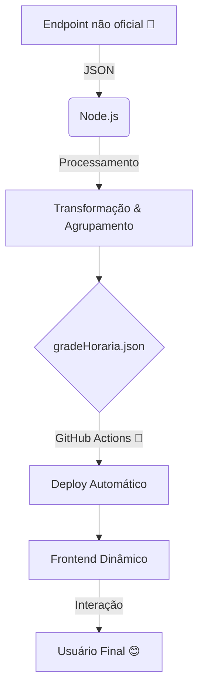
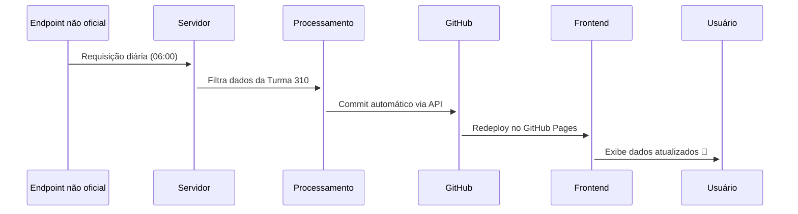

# ✨ Grade Horária 310 ✨
## 📚 Documentação Técnica

---

## 🚀 Funcionalidades Incríveis

- **🕒 Detecção Automática do Dia Atual**  
- **📊 Barra de Progresso em Tempo Real**  
- **🔄 Auto-Recarregamento nos Horários de Troca de Aula**  
- **📱 Design 100% Responsivo**  
- **🎞 Transições Animadas**  
- **📤 Compartilhamento Otimizado para WhatsApp**

---

## 🏗 Arquitetura do Sistema

> **⚠️ ATENÇÃO:**  
> Esta aplicação utiliza um **endpoint não oficial** para obter os dados da grade horária.  
> O serviço **pode parar de funcionar a qualquer momento** se houver alterações no endpoint!

---

## ⚡ Tecnologias Utilizadas

| Tecnologia             | Ícone |
|------------------------|:-----:|
| **JavaScript ES6+**    |  |
| **HTML5**              |  |
| **CSS3**               |  |
| **Node.js**            |  |
| **GitHub API**         |  |
| **GitHub Actions**     |  |
| **Endpoint API**       |  |

---

## 🔄 Fluxo de Dados em Tempo Real

---

## 🎨 Interface do Usuário

- **🌙 Dark Mode Automático**  
- **💡 Efeitos Neon e Blur Dinâmico**  
- **📐 Layout 100% Responsivo**  
- **📤 Compartilhamento via WhatsApp**

  

---

## 🚨 Aviso Importante

> **⚠️ ATENÇÃO:**  
> Esta aplicação utiliza um **endpoint não oficial** para obter a grade horária.  
> **O endpoint pode ser descontinuado ou alterado sem aviso prévio**, impactando o funcionamento do sistema!  
> Mantenha-se atento às atualizações e verifique regularmente o status do serviço.

---

## 📜 Licença

  
  
Uso livre, modificação e distribuição. Perfeito para estudos e integrações com APIs.

---

## 👨‍💻 Créditos

  <table>
    <tr>
      <td align="center">
        <a href="https://github.com/zKauaFerreira">
           
          <strong>Kauã Ferreira</strong>
        </a>
      </td>
      <td align="center">
        <a href="https://github.com/he4rt">
           
          <strong>@he4rt</strong>
        </a>
      </td>
      <td align="center">
         
        <strong>Turma 310</strong>
      </td>
    </tr>
  </table>

---

## 🔗 Links Úteis

- **Acesse o Projeto:** [https://zkauaferreira.github.io/310](https://zkauaferreira.github.io/310)  
- **Estatísticas:**  
  
  
